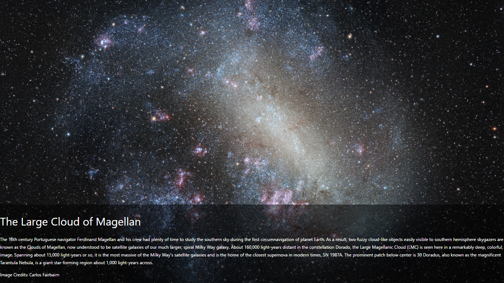
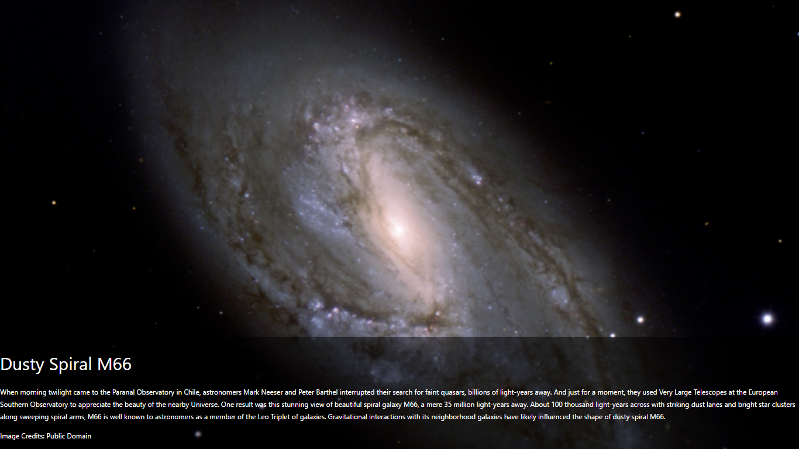
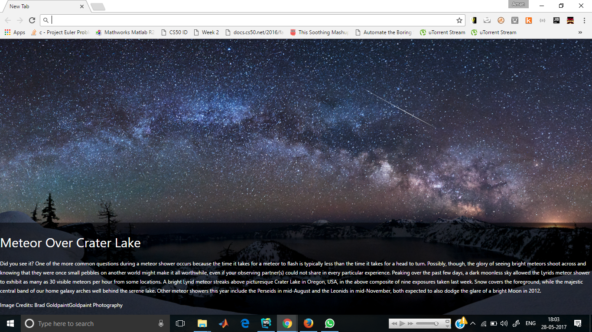

Nasa Picture of the day Google Chrome extension
==

* NASA POTD extension sets your newtab background as a beautiful picture with info retrieved from NASA's Picture of the Day Database

* Usage : Download the [.crx file](https://github.com/theamanbhargava/NASA_POTD/raw/master/NASA_POTD.crx) and install it in the following way :
  1) Settings-Icon > Tools > Extensions
     ( the 'three horizontal-bars' icon in the top-right corner )
  2)   Drag and drop the "crx" extension file onto the Extensions page from [step 1]
     ( .crx file should likely be in your Downloads directory )
  3)   Install

* Open up the extension by clicking on the icon of the moustached man

* Follow the instructions from the popup!

* Some Screenshots : 

